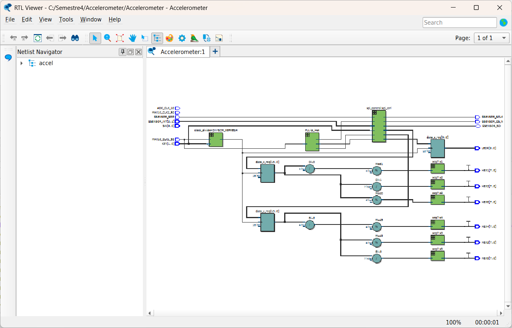

# 📈 Práctica – Lectura de Acelerómetro en FPGA (SPI)

## 📌 Descripción

En esta práctica se implementa un sistema para **leer los datos de un acelerómetro integrado en la FPGA DE10-Lite** utilizando comunicación **SPI**.

El sistema obtiene los valores de aceleración en los **tres ejes (X, Y, Z)** y los muestra en:

- **Displays de 7 segmentos** (ejes X y Y)
- **LEDs de la FPGA** (eje Z)

Esto permite observar cómo cambian los valores de aceleración al mover o inclinar la tarjeta FPGA.

---

# 🎯 Objetivo

Diseñar un sistema que permita:

- Leer datos de un **acelerómetro mediante SPI**
- Procesar los datos recibidos
- Mostrar los valores en **displays de 7 segmentos**
- Visualizar cambios de aceleración en los **LEDs**

---

# 🛠 Herramientas Utilizadas

- FPGA **DE10-Lite**
- Sensor acelerómetro **ADXL345** integrado
- **Intel Quartus Prime Lite**
- **Verilog HDL**

---

# 📡 Comunicación con el Acelerómetro

El acelerómetro se comunica mediante el protocolo **SPI (Serial Peripheral Interface)**.

Las señales utilizadas son:

| Señal | Función |
|------|---------|
| `GSENSOR_SCLK` | Reloj SPI |
| `GSENSOR_CS_N` | Chip Select |
| `GSENSOR_SDI` | Datos hacia el sensor |
| `GSENSOR_SDO` | Datos desde el sensor |
| `GSENSOR_INT` | Señales de interrupción |

---

# 🧠 Arquitectura del Sistema

El sistema está compuesto por varios módulos:

```
📂 Practica_Acelerometro
 ├── accel.v
 ├── spi_control.v
 ├── clock_divider.v
 ├── seg7.v
 ├── PLL.v
 ├── imagenes/
 └── README.md
```

---

# ⏱ Generación de Relojes

Se utiliza un **PLL** para generar diferentes frecuencias necesarias para el sistema.

| Señal | Frecuencia |
|------|-------------|
| `clk` | 25 MHz |
| `spi_clk` | 2 MHz |
| `spi_clk_out` | 2 MHz (fase 270°) |

Esto permite generar el reloj necesario para la comunicación SPI.

---

# 📊 Lectura de Datos del Acelerómetro

El módulo `spi_control` se encarga de:

- Inicializar el sensor
- Enviar comandos SPI
- Leer los datos de aceleración

Los datos obtenidos son:

| Señal | Descripción |
|------|-------------|
| `data_x` | Aceleración en eje X |
| `data_y` | Aceleración en eje Y |
| `data_z` | Aceleración en eje Z |

Cada valor es de **16 bits**.

---

# 🔄 Actualización de Datos

Los datos del sensor se actualizan a **2 Hz** utilizando un divisor de reloj:

```verilog
clock_divider #(.FREQ(2))
```

Esto permite que los valores en pantalla cambien lentamente y sean fáciles de observar.

---

# 📟 Visualización en Displays

Los valores de los ejes **X y Y** se separan en:

- Unidades
- Decenas
- Centenas

y se muestran en los displays de 7 segmentos:

| Display | Valor mostrado |
|------|----------------|
| HEX0 | Unidades X |
| HEX1 | Decenas X |
| HEX2 | Centenas X |
| HEX3 | Unidades Y |
| HEX4 | Decenas Y |
| HEX5 | Centenas Y |

La conversión se realiza mediante el módulo `seg7`.

---

# 💡 Visualización en LEDs

Los **LEDs de la FPGA** muestran el valor del eje Z:

```
LEDR = data_z_reg[9:0]
```

Esto permite observar visualmente los cambios en la aceleración vertical.

---

# 🎛 Entradas y Salidas

## Entradas

| Señal | Descripción |
|------|-------------|
| `MAX10_CLK1_50` | Reloj de 50 MHz |
| `KEY[0]` | Control de reset |
| `GSENSOR_INT` | Interrupciones del acelerómetro |

---

## Salidas

| Señal | Descripción |
|------|-------------|
| `HEX0–HEX5` | Displays de 7 segmentos |
| `LEDR` | LEDs que muestran el eje Z |
| `GSENSOR_CS_N` | Chip Select del acelerómetro |
| `GSENSOR_SCLK` | Reloj SPI |

---

# 📷 Evidencias

## Funcionamiento del sistema



## Lectura de datos en displays

Vídeo: https://drive.google.com/file/d/1N-N2ujGs5lzCppMX71qQoLlYJUiXt7Ge/view?usp=sharing

---

# ✅ Resultado

Se implementó correctamente un sistema capaz de:

- Leer datos de un **sensor acelerómetro**
- Comunicarse mediante **SPI**
- Procesar datos en FPGA
- Mostrar resultados en **displays y LEDs**

Este tipo de sistema es fundamental para aplicaciones como:

- Sistemas de navegación
- Detección de movimiento
- Control de orientación
- Sistemas embebidos con sensores

---

# 👨‍💻 Autor

Ángeles Araiza García A00574806
