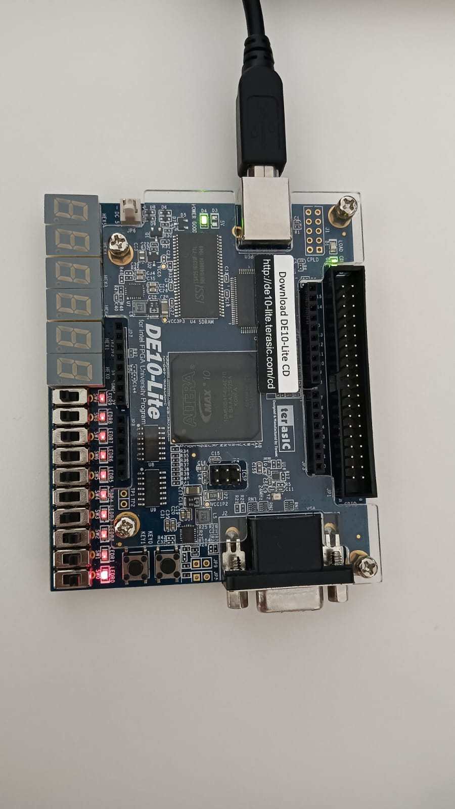

# Decodificación de Número Primo con 4 Variables en FPGA  

## 📌 Objetivo  
Implementar un sistema en Verilog que lea el valor de 4 switches de la FPGA, interprete su valor como un número binario y determine si es un número primo.  
El resultado se mostrará encendiendo un LED cuando el número sea primo.

---

## 🛠 Materiales Necesarios  

- Tarjeta FPGA DE10-Lite  
- Cable USB Blaster para la programación  
- Software Intel Quartus Prime Lite  
- Código en Verilog  

---

## ⚙️ Descripción del Funcionamiento  

- Los 4 switches de la FPGA representan un número en formato binario.  
- El sistema interpreta el valor ingresado (desde `0000` hasta `1111`, es decir, de 0 a 15 en decimal).  
- El módulo en Verilog evalúa si el número corresponde a un número primo.  
- Si el número es primo, el LED se enciende.  
- Si no es primo, el LED permanece apagado.  

---

## 🧠 Desarrollo de la Práctica  

### 1️⃣ Definición de Entradas y Salidas  

**Entradas:**  
- `SW[3:0]` → 4 switches que representan el número binario  

**Salidas:**  
- `LED` → Indica si el número es primo  

---

### 2️⃣ Implementación en Verilog  

- Crear un módulo principal que reciba `SW[3:0]` como entrada.  
- Implementar la lógica combinacional para determinar si el número es primo.  
- Asignar la salida del resultado al LED.  

---

### 3️⃣ Simulación y Verificación  

- Desarrollar un testbench para comprobar el correcto funcionamiento del módulo.  
- Simular todos los valores posibles (0–15).  
- Verificar que el LED se active únicamente para los números primos dentro de ese rango (2, 3, 5, 7, 11, 13).  

---

### 4️⃣ Estructura del Repositorio  

```
📂 Decodificador-Primo-FPGA
 ├── primo_detector.v
 ├── primo_detector_tb.v
 ├── constraints.qsf
 ├── /imagenes
 │     ├── simulacion.png
 │     └── funcionamiento_fpga.jpg
 └── README.md
```

---

## ✅ Resultado Esperado  

El sistema debe encender el LED únicamente cuando el valor ingresado en los switches corresponda a un número primo dentro del rango de 0 a 15

## 📷 Evidencia de Simulación

[](imagenes/Practica1_RTL.png)

## 💡 Funcionamiento en FPGA

[](imagenes/funcionamiento2_fpga.jpeg)
<p align="center">
  
 
</p>


