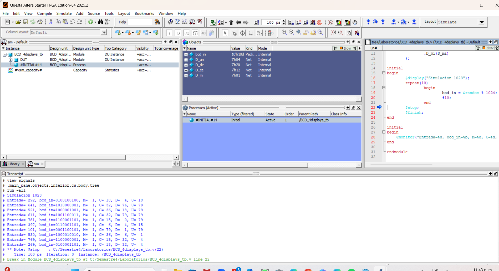
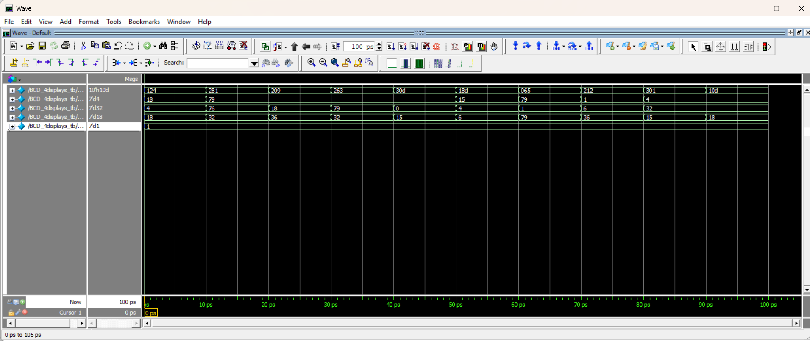

# 🔢 Práctica 2 – Conversión BCD para 4 Displays en FPGA

## 📌 Descripción

En esta práctica se implementa un módulo en **Verilog HDL** capaz de convertir un número binario en sus correspondientes **dígitos decimales** y mostrarlos en **cuatro displays de 7 segmentos**.

El sistema divide el número de entrada en **unidades, decenas, centenas y millares**, utilizando operaciones aritméticas, y posteriormente convierte cada dígito a su representación en un **display de 7 segmentos** mediante un módulo BCD.

---

# 🎯 Objetivo

Diseñar un módulo digital que:

- Reciba un número binario de entrada
- Lo convierta a sus dígitos decimales
- Muestre cada dígito en un **display de 7 segmentos**
- Utilice **módulos jerárquicos** en Verilog

---

# 🛠 Materiales y Herramientas

- Tarjeta FPGA **DE10-Lite**
- Software **Intel Quartus Prime Lite**
- Lenguaje **Verilog HDL**
- Cable **USB Blaster**

---

# ⚙️ Funcionamiento del Sistema

El sistema recibe un número binario `bcd_in` y calcula sus componentes decimales:

- **Unidades**
- **Decenas**
- **Centenas**
- **Millares**

Esto se realiza utilizando operaciones de **división y módulo**.

---

# 🎛 Entradas y Salidas

## Entrada

| Señal | Descripción |
|------|-------------|
| `bcd_in` | Número binario de entrada |

---

## Salidas

| Señal | Descripción |
|------|-------------|
| `D_un` | Display de unidades |
| `D_de` | Display de decenas |
| `D_ce` | Display de centenas |
| `D_mi` | Display de millares |

Cada salida controla un **display de 7 segmentos**.

---

# 🧠 Arquitectura del Sistema

El sistema está compuesto por:

```
📂 Practica_2_BCD_Displays
 ├── BCD_4displays.v
 ├── BCD_module.v
 ├── testbench.v
 ├── imagenes/
 └── README.md
```

---

# 🔧 Módulo Principal: BCD_4displays

Este módulo divide el número binario en sus dígitos decimales.

### Parámetros

```
N_in  = número de bits de entrada
N_out = número de bits de salida para el display
```

Por defecto:

```
N_in = 10
N_out = 7
```

---

# 🔢 Separación de Dígitos

El sistema calcula cada dígito de la siguiente forma:

```verilog
unidades = bcd_in % 10;
decenas = (bcd_in / 10) % 10;
centenas = (bcd_in / 100) % 10;
millares = (bcd_in / 1000) % 10;
```

Esto permite obtener cada posición decimal del número.

---

# 📟 Conversión a Display de 7 Segmentos

Cada dígito se envía al módulo:

```
BCD_module
```

Este módulo convierte el número BCD en la señal necesaria para controlar un **display de 7 segmentos**.

---

# 🔄 Flujo del Sistema

```
Número binario (bcd_in)
        │
        ▼
Separación de dígitos
(unidades, decenas, centenas, millares)
        │
        ▼
Módulo BCD
        │
        ▼
Displays de 7 segmentos
```

---

# 🧪 Simulación

Se realizaron simulaciones para verificar:

- Correcta separación de dígitos
- Conversión correcta a señales de display
- Visualización adecuada en los 4 displays

---

# 📷 Evidencias

## Simulación




## Funcionamiento en FPGA


---

# ✅ Resultado

Se implementó correctamente un sistema capaz de:

- Convertir números binarios a **formato decimal**
- Mostrar hasta **4 dígitos** en displays de 7 segmentos
- Utilizar **modularidad en Verilog**

Este módulo puede reutilizarse en múltiples proyectos digitales que requieran **visualización numérica en FPGA**.

---

# 👨‍💻 Autor

Àngeles Araiza Garcìa A00574806
