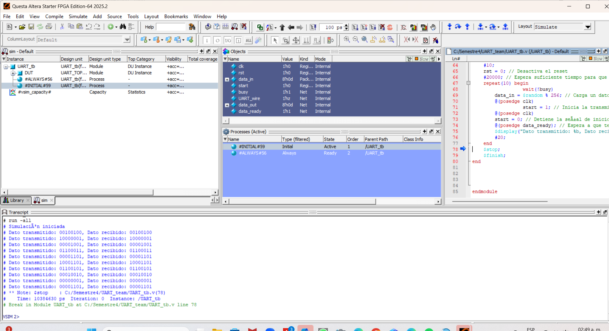
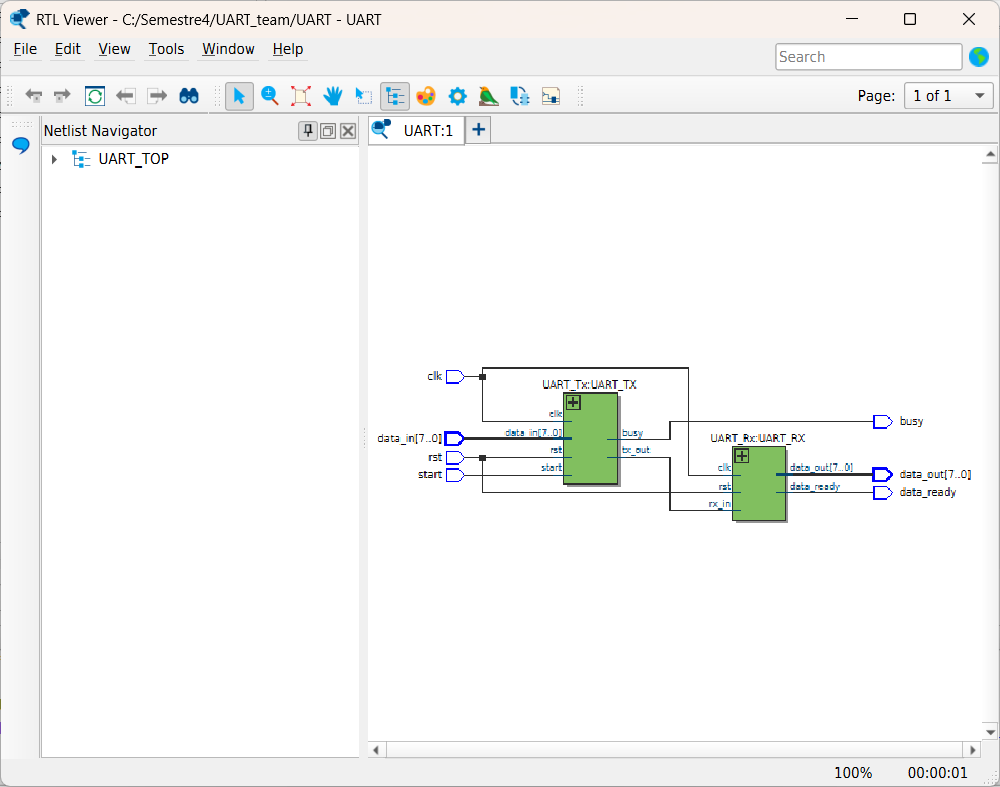
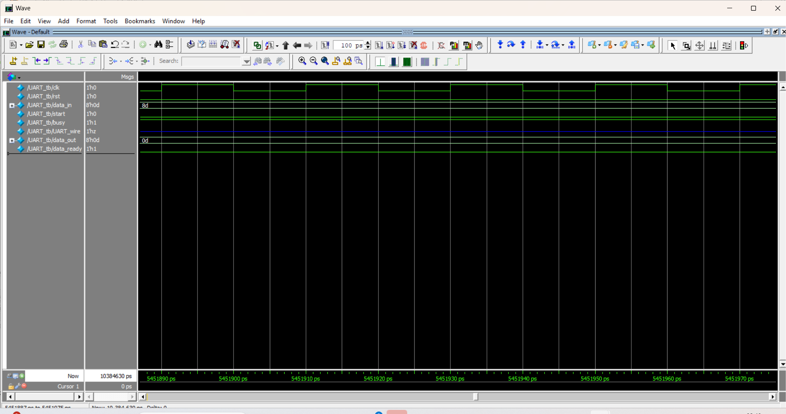
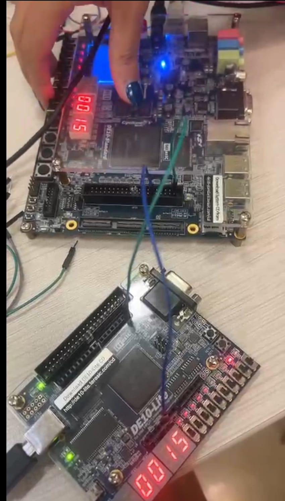

# 📡 Práctica – Comunicación UART en FPGA

## 📌 Descripción

En esta práctica se implementa un sistema de **comunicación serial UART (Universal Asynchronous Receiver Transmitter)** utilizando **Verilog HDL** en una FPGA.

El sistema está compuesto por dos módulos principales:

- **UART_Tx** → Transmisor de datos
- **UART_Rx** → Receptor de datos

Ambos módulos son integrados mediante un módulo superior **UART_TOP**, que conecta la salida del transmisor con la entrada del receptor para verificar el correcto funcionamiento del sistema.

La comunicación se realiza a una velocidad de **9600 baudios**, utilizando un reloj de **50 MHz**.

---

# 🎯 Objetivo

Diseñar e implementar un sistema UART que permita:

- Transmitir datos serialmente
- Recibir datos seriales
- Verificar la correcta transmisión de un byte
- Comprender el funcionamiento de protocolos seriales asíncronos

---

# 🛠 Herramientas Utilizadas

- FPGA **DE10-Lite**
- **Intel Quartus Prime Lite**
- **Verilog HDL**
- Simulación mediante **ModelSim**

---

# 📡 Protocolo UART

UART es un protocolo de comunicación serial **asíncrono**, que transmite datos bit a bit utilizando una línea de transmisión.

Cada trama UART está compuesta por:

```
| Start Bit | Data Bits | Stop Bit |
```

Para esta práctica:

| Parámetro | Valor |
|--------|------|
| Baud Rate | 9600 |
| Bits de datos | 8 |
| Bits de parada | 1 |
| Paridad | No utilizada |

---

# 🧠 Arquitectura del Sistema

El sistema está compuesto por tres módulos principales:

```
📂 Practica_UART
 ├── UART_TOP.v
 ├── UART_Tx.v
 ├── UART_Rx.v
 ├── testbench.v
 ├── imagenes/
 └── README.md
```

---

# 🔗 Módulo Top

El módulo `UART_TOP` conecta el transmisor y el receptor.

```verilog
UART_Tx → transmisión de datos
UART_Rx → recepción de datos
```

La conexión se realiza mediante una línea interna:

```
UART_wire
```

Flujo del sistema:

```
data_in
   │
   ▼
UART_TX
   │
   ▼
UART_wire
   │
   ▼
UART_RX
   │
   ▼
data_out
```

---

# 📤 Módulo UART_Tx (Transmisor)

El transmisor se encarga de enviar datos serialmente.

### Estados de la FSM

| Estado | Función |
|------|---------|
| IDLE | Espera para transmitir |
| START_BIT | Envía bit de inicio |
| DATA_BITS | Envía los bits de datos |
| STOP_BIT | Envía bit de parada |

### Funcionamiento

1. Cuando `start` se activa, se carga `data_in`.
2. Se transmite el **bit de inicio (0)**.
3. Se transmiten los **8 bits de datos**.
4. Se transmite el **bit de parada (1)**.
5. El sistema vuelve a estado `IDLE`.

---

# 📥 Módulo UART_Rx (Receptor)

El receptor detecta y reconstruye los datos seriales.

### Estados de la FSM

| Estado | Función |
|------|---------|
| IDLE | Espera el bit de inicio |
| START_BIT | Verifica inicio de transmisión |
| DATA_BITS | Captura los bits de datos |
| STOP_BIT | Verifica bit de parada |

### Características

- Sincronización de entrada para evitar **metastabilidad**
- Muestreo en el **centro del bit**
- Señal `data_ready` para indicar recepción completa

---

# 🎛 Entradas y Salidas

## Entradas

| Señal | Descripción |
|------|-------------|
| `clk` | Reloj del sistema |
| `rst` | Reset del sistema |
| `data_in[7:0]` | Datos a transmitir |
| `start` | Inicia la transmisión |

---

## Salidas

| Señal | Descripción |
|------|-------------|
| `busy` | Indica que el transmisor está activo |
| `data_out[7:0]` | Datos recibidos |
| `data_ready` | Indica que un byte fue recibido |

---

# ⏱ Cálculo del Baud Rate

El tiempo de cada bit se calcula a partir de:

```
CLOCK_FREQ / BAUD_RATE
```

Para esta práctica:

```
50,000,000 / 9600 ≈ 5208 ciclos
```

Este valor se utiliza en los contadores de temporización.

---

# 🧪 Simulación

Durante la simulación se verificó:

- Transmisión correcta de datos
- Recepción correcta del byte enviado
- Funcionamiento de la máquina de estados
- Generación correcta del bit de inicio y parada

---

# 📷 Evidencias

## Simulación UART






## Funcionamiento del sistema



Vídeo: https://drive.google.com/file/d/1236UuAP8VD0LsCsEr4rU3ufhOTayym1g/view?usp=sharing

---

# ✅ Resultado

Se implementó correctamente un sistema de comunicación **UART completo (Tx + Rx)** que permite:

- Transmisión serial de datos
- Recepción y reconstrucción del byte transmitido
- Sincronización correcta con el baud rate

Este sistema representa una base fundamental para **comunicación serial entre FPGA, microcontroladores o computadoras**.

---

# 👨‍💻 Autor
Ángeles Araiza García A00574806
