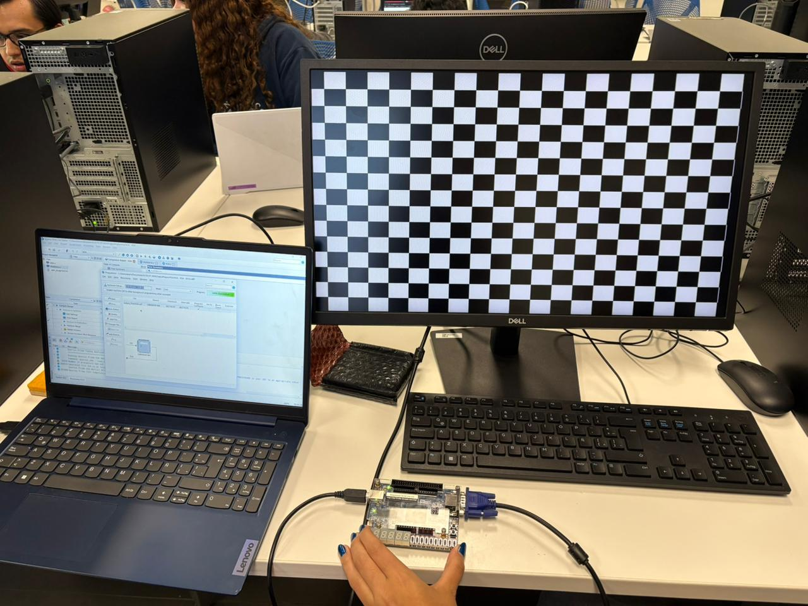
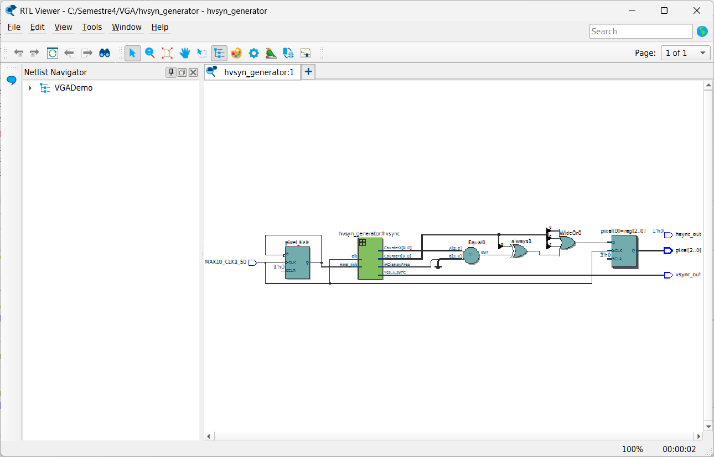

# 🖥 Práctica – Generación de Video VGA en FPGA (Tablero de Ajedrez)

## 📌 Descripción

En esta práctica se implementa un sistema de **generación de señal VGA** utilizando **Verilog HDL** en una FPGA.  
El sistema produce una imagen en un monitor VGA generando las señales de sincronización horizontal y vertical necesarias para mostrar gráficos.

Como demostración del funcionamiento, se genera un **patrón de tablero de ajedrez**, donde los cuadros blancos y negros se alternan en la pantalla.

---

# 🎯 Objetivo

Diseñar un sistema capaz de:

- Generar señales **VGA de sincronización horizontal y vertical**
- Controlar la posición de los píxeles en pantalla
- Dibujar un patrón gráfico simple
- Mostrar un **tablero de ajedrez** en un monitor VGA

---

# 🛠 Herramientas Utilizadas

- FPGA **DE10-Lite**
- **Intel Quartus Prime Lite**
- **Verilog HDL**
- Monitor **VGA**

---

# 📺 Resolución VGA Utilizada

El sistema utiliza la resolución estándar:

| Parámetro | Valor |
|------|------|
| Resolución | 640 × 480 |
| Frecuencia de refresco | 60 Hz |
| Pixel Clock | 25 MHz |

Para lograr el **pixel clock de 25 MHz**, se divide el reloj principal de **50 MHz**.

---

# 🧠 Arquitectura del Sistema

El sistema está compuesto por los siguientes módulos:

```
📂 Practica_VGA
 ├── VGADemo.v
 ├── hvsync_generator.v
 ├── imagenes/
 └── README.md
```

---

# ⏱ Generación del Pixel Clock

El reloj de la FPGA es de **50 MHz**, por lo que se divide entre 2 para obtener **25 MHz**, necesario para VGA.

```verilog
reg pixel_tick = 0;

always @(posedge MAX10_CLK1_50)
    pixel_tick <= ~pixel_tick;
```

---

# 📏 Generador de Sincronización VGA

El módulo `hvsync_generator` genera:

- `hsync` → sincronización horizontal
- `vsync` → sincronización vertical
- `CounterX` → posición horizontal del píxel
- `CounterY` → posición vertical del píxel
- `inDisplayArea` → indica si el píxel está dentro del área visible

---

# 🎨 Generación del Tablero de Ajedrez

El patrón del tablero se genera usando una operación **XOR** entre partes de los contadores X y Y.

```verilog
CounterX[9:6] ^ CounterY[9:6]
```

Esto divide la pantalla en bloques y alterna su color.

### Lógica de píxeles

```verilog
if(inDisplayArea == CounterX[9:6]^CounterY[9:6])
    pixel <= 3'b111;
else
    pixel <= 3'b000;
```

- `111` → píxel blanco
- `000` → píxel negro

Esto produce el patrón de **tablero de ajedrez**.

---

# 🖼 Flujo del Sistema

```
Clock 50MHz
     │
     ▼
Divisor de reloj (25MHz)
     │
     ▼
Generador VGA Sync
     │
     ▼
Contadores X,Y
     │
     ▼
Lógica de píxeles
     │
     ▼
Salida RGB + HSYNC + VSYNC
     │
     ▼
Monitor VGA
```

---

# 🎛 Entradas y Salidas

## Entradas

| Señal | Descripción |
|------|-------------|
| `MAX10_CLK1_50` | Reloj de 50 MHz de la FPGA |

---

## Salidas

| Señal | Descripción |
|------|-------------|
| `pixel[2:0]` | Señal RGB de píxel |
| `hsync_out` | Sincronización horizontal |
| `vsync_out` | Sincronización vertical |

---

# 📷 Evidencias

## Patrón generado en monitor




## Simulación o señal VGA



---

# ✅ Resultado

Se implementó correctamente un sistema de **generación de video VGA**, capaz de:

- Generar señales de sincronización VGA
- Controlar píxeles mediante contadores
- Mostrar patrones gráficos en pantalla

El sistema genera un **tablero de ajedrez** utilizando operaciones lógicas sobre las coordenadas de los píxeles.

---

# 👨‍💻 Autor

Ángeles Araiza García A00574806
